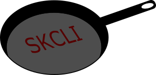

# SkilletCLI
[](https://travis-ci.org/adambaumeister/skilletcli)

## Overview
This utility provides a command line interface to Palo Alto "skillets", 
curated configuration templates designed to be imported into firewalls or Panorama.

## Installation
### Pre-requisites
To use skilletcli, a Git client must be installed.

[Binaries for windows/OSX can be found here](https://git-scm.com/)

Linux users can use their preferred package manager.

### Getting the code
**windows**

[Download the latest release from the releases page.](https://github.com/adambaumeister/skilletcli/releases)

**mac**
```bash
command -v git ; if [[ $? != 0 ]] ; then echo "Git not installed." ; else curl -L https://github.com/adambaumeister/skilletcli/releases/latest/download/skilletcli -o skilletcli ; chmod +x skilletcli ; fi
```
Note for mac users: Skilletcli is built on macOS 10.14. Newer/older builds may not be compatible and in that case, you need to run
from source.

**linux**
```bash
command -v git ; if [[ $? != 0 ]] ; then echo "Git not installed." ; else curl -L https://github.com/adambaumeister/skilletcli/releases/latest/download/skilletcli -o skilletcli ; chmod +x skilletcli ; fi
```

### Preparing the environment
SkilletCLI requires a variable file to be populated before use.

This file is used to template various snippets with environment specific information.
By default, this file is named config_variables.yaml, and it is retrieved from the current directory (_./config_variables.yml_)

[click here to see a complete example, populated with default values](config_variables.yaml)

If this file is not specified or is missing/unavailable, defaults will be used. 

## Usage
### Overview of skillet layout
SkilletCLI returns a structure like the below:

Skillet Collection/Skillets/Snippet stacks/Snippet

A skillet collection is a group of skillets associated with a type, such as PANOS or PANORAMA. 
A snippet stack is a collection of snippets that have a specific use case.

By default, SkilletCLI will use the device type of the target firewall to determine which skillet type to use, and 
"snippets" for the snippet stack to use.

### Basic usage
*list all available snippets, skillets, and skillet collections*
```bash
skilletcli
```
This command lists all the available snippets.

*push a snippet to a device*
```bash
skilletcli address
```
This will push a single snippet "address" to the device, prompting for all login settings.

*push multiple snippets*
```bash
skilletcli address tag external_list
```
Same as the above except push multiple snippets in the one command. As many snippets as is required 
can be pushed like this.

### Key storage
APIkeys can be stored locally to avoid the use of environment variables for command line flags.

The keystore can be enabled by passing the flag --enable_keystore when running any skcli command. If authentication is sucessful, the generated API key
will be stored in $HOME/.skcli.json.

After the keystore has been enabled once, the flag does not need to be re-specified on subsequent runs.
```
# Enable the keystore
skilletcli --enable_keystore <args>
```
```
# Clear the keystore 
skilletcli --clear_keystore
```
### Environment variables
SkilletCLI allows you to use environment variables instead of an interactive prompt.

The variables are:
* SKCLI_USERNAME
* SKCLI_PASSWORD
* SKCLI_ADDRESS

### Experimental: HTTP-based skillet retrieval
Skillets will eventually be hosted centrally, via a publicly accessible API.
If you retrieve skillets this way, you do _not_ need a Git client.

**At the moment, this functionality is still in dev, so use at your own risk.**

To leverage this functionality add the flags --repotype and --repopath, as below.
```bash
skilletcli --repotype api --repopath https://skillet-deploy.appspot.com
```


## Developing SkilletCLI
Contributing to SkilletCLI requires Python 3.6+ installed on your machine.

After it is installed, it's recommended to create a virtual environment so the code is standalone.

```bash
python3 -m venv venv
# Windows
venv/scripts/activate
# *nix
source venv/scripts/activate
```

Clone the code and install the module requirements.

```bash
git clone https://github.com/adambaumeister/skilletcli.git
cd skilletcli
pip install -r requirements.txt
```

You are now ready to make your changes!

### Testing
Testing of skilletcli is broken up into two logical processes
1. Unit testing, or the testing of standalone functions
2. Integration testing, or the testing of functions against real PANOS devices

All testing is initatiated using *pytest*. 
```bash
pytest
```

By default, only unit tests will be run. To run integration testing, you must specify the standard
SKCLI environment variables (address, username, password) of the device to test against
as well as an additional env var: *SKCLI_DEVICE_TEST*. 
After setting up the environment, simply run *pytest* as normal.

Pytest is run automatically as part of CI using TravisCI whenever changes are detected to Master. CI only runs unit tests.

### Test Coverage
After updating skcli, you can rerun the coverage tests and update the little icon using the below.
```bash
coverage run --omit ./venv* -m pytest
coverage-badge -o .github/cov.svg
```

### Packaging
Binary packaging is done using pyinstaller, managed by Travis. Packaging occurs on the publish of a release
(tag) on the master branch.  

Pypi distribution is also handled via Travis on each tagged release. 

Manual pypi packaging:
```bash
pip install setuptools wheel
pip install twine
python setup.py bdist bdist_wheel
twine upload --repository-url https://test.pypi.org/legacy/ dist/*
```